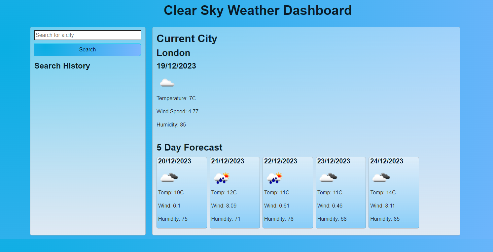

# Clear Sky Weather Dashboard ☀️

## Deployed Website Link

https://digitallyalex.github.io/clear-sky-weather/

## Description

Weather dashboard showing a 5-day forecast with a city search functionality.

This app uses the Open Weather API to display the current weather and a 5 day weather forecast based on the searched city. It also gives the option to click on previous searches and display the updated data for those cities.

## Installation

N/A

## Usage

When users first enter the page, they see the search bar and are prompted to search for a city. When they click on the 'Search' button, the current day data is displayed on the right hand side, with a 5 day forecast underneath.

If needed, users can perform searches for different cities, and the search history will be saved underneath the search button as clickable buttons.

## Credits

Overall instruction and provision of necessary materials for this project from the EdX Front-End Web Development Bootcamp instructor and teaching assistants (Oct2023 Cohort).

Additionally, a few resources and tutorials were very helpful in guiding me towards the completion of this task and learning JavaScript overall:

- Boostrap Documentation: https://getbootstrap.com/docs/
- On displaying the openweathermap weather icon: https://stackoverflow.com/questions/44177417/how-to-display-openweathermap-weather-icon
- On using toLocaleDateString(): https://developer.mozilla.org/en-US/docs/Web/JavaScript/Reference/Global_Objects/Date/toLocaleDateString
- On Array.prototype.indexOf(): https://developer.mozilla.org/en-US/docs/Web/JavaScript/Reference/Global_Objects/Array/indexOf
- On saving input data to local storage: https://stackoverflow.com/questions/10333230/save-input-data-to-localstorage-on-button-click
- For lovely gradients used in the project: https://gradients.shecodes.io/gradients/440
- Open Weather Map Documentation: https://openweathermap.org/forecast5#5days

Badges at the bottom of this README file were listed with the help of the following repository: https://github.com/Ileriayo/markdown-badges

## License

MIT License

Copyright (c) 2023 Alexandra Asanache

Permission is hereby granted, free of charge, to any person obtaining a copy of this software and associated documentation files (the "Software"), to deal in the Software without restriction, including without limitation the rights to use, copy, modify, merge, publish, distribute, sublicense, and/or sell copies of the Software, and to permit persons to whom the Software is furnished to do so, subject to the following conditions:

The above copyright notice and this permission notice shall be included in all copies or substantial portions of the Software.

THE SOFTWARE IS PROVIDED "AS IS", WITHOUT WARRANTY OF ANY KIND, EXPRESS OR IMPLIED, INCLUDING BUT NOT LIMITED TO THE WARRANTIES OF MERCHANTABILITY, FITNESS FOR A PARTICULAR PURPOSE AND NONINFRINGEMENT. IN NO EVENT SHALL THE AUTHORS OR COPYRIGHT HOLDERS BE LIABLE FOR ANY CLAIM, DAMAGES OR OTHER LIABILITY, WHETHER IN AN ACTION OF CONTRACT, TORT OR OTHERWISE, ARISING FROM, OUT OF OR IN CONNECTION WITH THE SOFTWARE OR THE USE OR OTHER DEALINGS IN THE SOFTWARE.

## Badges

      
